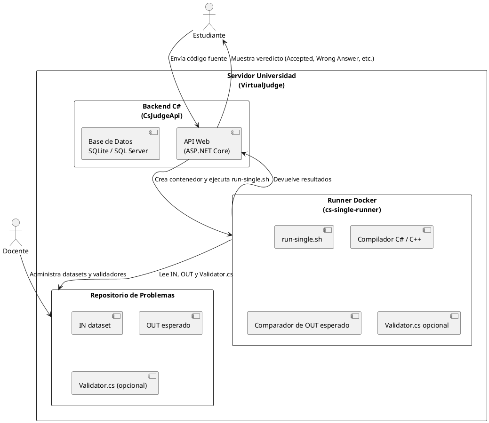

# VirtualJudge Architecture

## Main Components

- **Backend (CsJudgeApi)**  
  Implemented in ASP.NET Core (C#).  
  - Exposes a REST API that receives students’ submissions.  
  - Coordinates execution of submitted programs.  
  - Stores results and metadata in the database (SQLite or SQL Server).

- **Runner Docker (cs-single-runner)**  
  A short-lived container is created for each submission.  
  - Executes the script `run-single.sh`.  
  - Compiles the student’s program (C# or C++).  
  - Runs each input dataset (`.in`) and produces the corresponding output.  
  - Compares the student’s output with the expected `.out` file.  
  - If a `Validator.cs` exists, it is compiled and executed to apply additional rules (useful when multiple correct answers are possible).

- **Problem Repository (`problems/`)**  
  Each problem contains:  
  - Input files (`*.in`)  
  - Expected output files (`*.out`)  
  - Optional `Validator.cs` to check complex rules.

## Execution Flow

1. A student uploads their solution via the web interface (frontend/API).  
2. The backend (`CsJudgeApi`) receives the submission and spawns a Docker container using the `cs-single-runner` image.  
3. Inside the container, `run-single.sh` performs the following:  
   - Compiles the student’s code.  
   - Executes it against all datasets.  
   - Compares results with the expected output or delegates validation to `Validator.cs`.  
4. The container returns the verdict to the backend.  
5. The backend stores the result and notifies the student (e.g., **Accepted**, **Wrong Answer**, **Runtime Error**, etc.).

## High-Level Diagram

  

