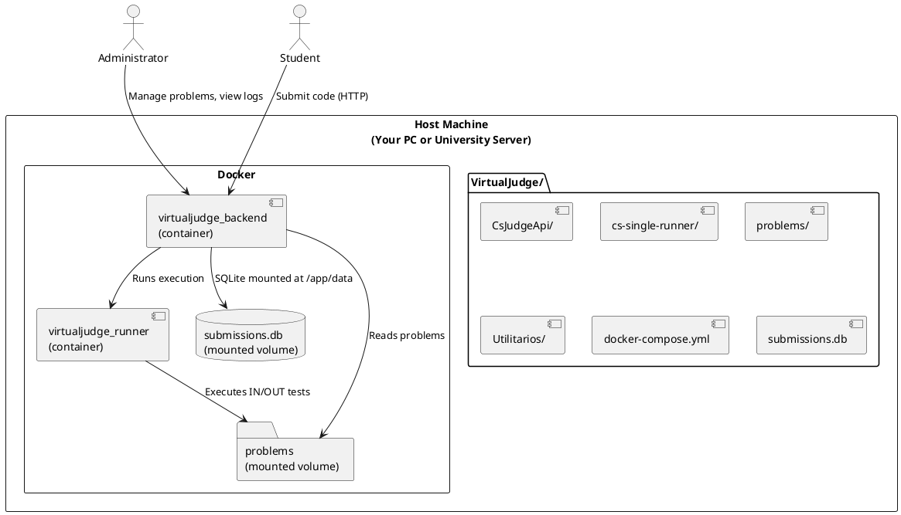

# VirtualJudge – Docker Architecture

This document explains what happens when you run `docker compose build` and `docker compose up -d` for the **VirtualJudge** project.

---

## 1. Project Layout (on host machine)

```
VirtualJudge/
│
├── CsJudgeApi/             # Backend (ASP.NET Core, SQLite)
│   ├── Program.cs
│   ├── CsJudgeApi.csproj
│   ├── submissions.db
│   └── Dockerfile
│
├── cs-single-runner/       # Runner (sandbox for C#/C++ submissions)
│   ├── Dockerfile
│   ├── run_single.sh
│   └── ...
│
├── problems/               # Problem repository (IN/OUT/Validator.cs)
├── Utilitarios/            # Extra utilities
├── docker-compose.yml      # Orchestration file
└── ARCHITECTURE.md
```

---

## 2. What `docker compose build` does

- Reads the **`docker-compose.yml`** at the root of `VirtualJudge/`.
- Looks for the services:
  ```yaml
  backend:
    build: ./CsJudgeApi
  runner:
    build: ./cs-single-runner
  ```
- Executes the `Dockerfile` inside each subfolder.
- Produces **two local Docker images**:
  - `virtualjudge_backend:latest`
  - `virtualjudge_runner:latest`

---

## 3. What `docker compose up -d` does

- Creates and starts **two containers**:
  - **virtualjudge_backend**  
    - Runs the ASP.NET Core API.  
    - Mounts `submissions.db` at `/app/data/submissions.db`.  
    - Mounts `problems/` at `/app/problems`.
  - **virtualjudge_runner**  
    - Sandbox that compiles and runs student submissions.  
    - Mounts `problems/` at `/problems`.

- Docker also creates:
  - **One internal network** so backend and runner can communicate.  
  - **Two mounted volumes** from the host:
    - `./CsJudgeApi/submissions.db` → `/app/data/submissions.db`  
    - `./problems/` → shared with both containers

---

## 4. Execution Flow

1. A **student** sends code to the backend (`http://localhost:8080`).  
2. The **backend** receives the submission, spawns a temporary runner container, and executes `run_single.sh`.  
3. The **runner** compiles the student’s code, runs it against the datasets (`.in` / `.out`), and validates with `Validator.cs` if present.  
4. The **runner** returns results to the backend.  
5. The **backend** stores the verdict in `submissions.db` and responds to the student.

---

## 5. Diagram (PlantUML)



---

✅ With this setup, your system is fully dockerized:  
- **2 images** → backend + runner  
- **2 containers** → running services  
- **1 network** → internal communication  
- **2 volumes** → persistent DB + problems  
