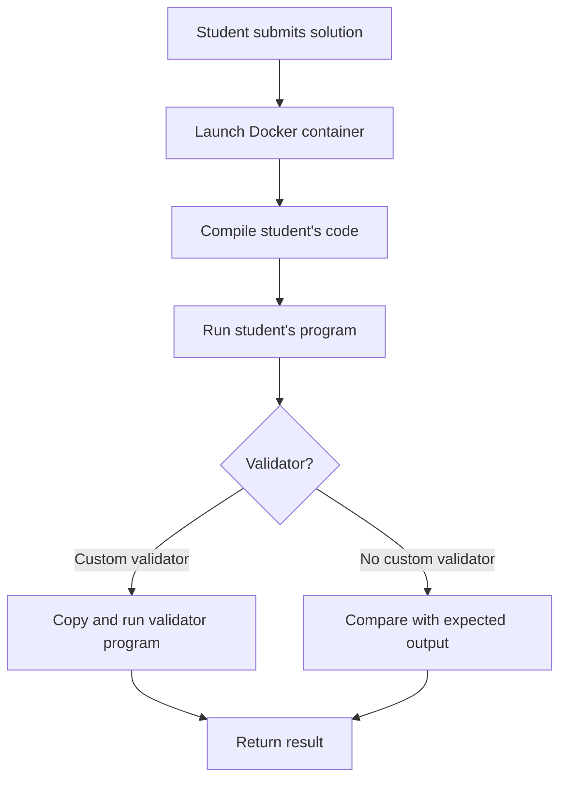

# 🎓 VirtualJudge

VirtualJudge is an **educational online judge** developed for the Catholic University of Bolivia.  
It allows students to **compile, run, and validate programs** in a controlled and secure environment.  

Currently it supports **C#**, and is planned to be extended to **C++** and other languages.

---

## 🚀 Key Features
- ✅ Compile and run programs in C#.  
- ✅ Automatic dataset validation (input/output).  
- ✅ **Custom validators** support:  
  - For problems where more than one valid solution may exist, instructors can provide a **custom validator program**.  
  - The source code path of the validator is stored in the field `FullPathValidatorSourceCode` in the `Questions` table.  
  - If `FullPathValidatorSourceCode` is not null, VirtualJudge copies that program into the student's temporary compilation directory and executes it against the student's output.  
  - If `FullPathValidatorSourceCode` is empty, the system falls back to the traditional output comparison (expected vs. student’s output).  
- ✅ Integration with **SQLite** for result storage.  
- ✅ Auxiliary scripts in **Python** and **Bash**.  
- ✅ **Docker-based sandboxing**:  
  - Each student request runs inside an **isolated Docker container**.  
  - The container is built on demand, compiles and executes the student's code, and validates the output safely.  
  - This ensures reproducibility and avoids security risks.  
- 🔜 Upcoming: support for C++ and additional languages.

---

## 📂 Project Structure
```
VirtualJudge/
 ├── C#           → C# programs (API, validators, runner)
 ├── python       → Auxiliary scripts
 ├── docker       → Dockerfile and container configuration
 ├── datasets     → Sample input/output test files
 ├── db           → Database schema (SQLite)
 ├── scripts      → Shell scripts for setup and execution
 └── README.md    → This file
```

---

## ⚙️ Quick Installation & Usage

Clone the repository:
```bash
git clone https://github.com/gcarlossuarez/VirtualJudge.git
cd VirtualJudge
```

### Option 1: Run locally
Make sure you have installed:
- .NET SDK (for C# compilation)
- Python 3
- SQLite
- Bash

Then run the provided scripts in `scripts/`.

### Option 2: Run with Docker (recommended for C#)
A basic `Dockerfile` is provided to run C# submissions inside isolated containers:

```bash
docker build -t virtualjudge .
docker run -it --rm -v $(pwd):/workspace virtualjudge
```

This will:
- Build an image with .NET 8 SDK and the sandbox environment.  
- Run student submissions inside a container.  
- Use `run_single.sh` as the entrypoint to compile and execute programs.  

⚠️ Note: Currently, this Dockerfile only supports **C#**.  
Additional compilers (e.g., C++ with `g++`) can be added in future versions.

---

## 🎯 Educational Goals
This project was designed to:
- 💡 Support courses like **Algorithm Analysis** and **Data Structures**.  
- 🧑‍💻 Let students practice by submitting programs automatically evaluated.  
- 📊 Provide fast and fair feedback.  
- 🎛️ Allow flexible evaluation using **custom validators**, enabling open-ended problems and creative solutions.  
- 🛡️ Guarantee safe execution of untrusted code using **Docker containers**.  

---

## 📊 Workflow Diagram



---

## 🤝 Contributions
Contributions are welcome for:
- Adding support for new languages (C++, Java, Python).  
- Improving submission and validation workflows.  
- Enhancing the **custom validator system**.  
- Optimizing sandbox performance.  

---

## 📜 License
This project is licensed under the **MIT License**.  
Feel free to use it for educational or research purposes.

---

## 🌐 Author
👤 **German Carlos Suarez**  
🔗 [LinkedIn Profile](https://www.linkedin.com/in/...)
