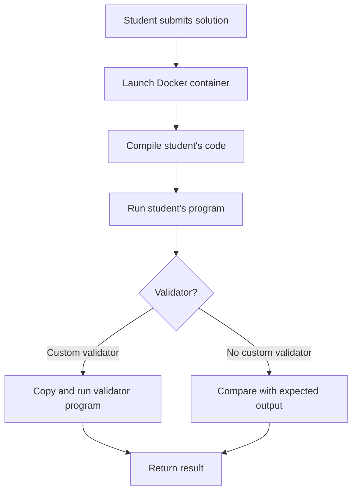

# 🏗️ Virtual Judge

This project implements a **virtual judge** that allows students to compile and run programs in different languages ​​inside isolated Docker containers.

Currently supports:

- ✅ **C# (.NET 8)**
- ✅ **C++ (g++)**
- 🚧 Python (in progress)
- 🚧 Java (in progress)

---

## 🚀 Key Features
- ✅ Compile and run programs in C# and C++.  
- ✅ Automatic dataset validation (input/output).  
- ✅ **Custom validators** support:  
  - For problems where more than one valid solution may exist, instructors can provide a **custom validator program**.  
  - The source code path of the validator is stored in the field `FullPathValidatorSourceCode` in the `Questions` table.  
  - If `FullPathValidatorSourceCode` is not null, VirtualJudge copies that program into the student's temporary compilation directory and executes it against the student's output.  
  - If `FullPathValidatorSourceCode` is empty, the system falls back to the traditional output comparison (expected vs. student’s output).  
- ✅ Integration with **SQLite** for result storage.  
- ✅ Auxiliary scripts in **Python** and **Bash**.  
- ✅ **Docker-based sandboxing**:  
  - Each student request runs inside an **isolated Docker container**.  
  - The container is built on demand, compiles and executes the student's code, and validates the output safely.  
  - This ensures reproducibility and avoids security risks.  
- 🔜 Upcoming: support for Java and additional languages.

---

## 📂 Project Structure
```
VirtualJudge/
 ├── C#           → C# programs (API, validators, runner)
 ├── python       → Auxiliary scripts
 ├── docker       → Dockerfile and container configuration
 ├── datasets     → Sample input/output test files
 ├── db           → Database schema (SQLite)
 ├── scripts      → Shell scripts for setup and execution
 └── README.md    → This file
```

---

## ⚙️ Quick Installation & Usage

Clone the repository:
```bash
git clone https://github.com/gcarlossuarez/VirtualJudge.git
cd VirtualJudge
```

### Option 1: Run locally
Make sure you have installed:
- .NET SDK (for C# compilation)
- Python 3
- SQLite
- Bash

Then run the provided scripts in `scripts/`.

### Option 2: Run with Docker (recommended for C#)
A basic `Dockerfile` is provided to run C# submissions inside isolated containers:

```bash
docker build -t virtualjudge .
docker run -it --rm -v $(pwd):/workspace virtualjudge
```

This will:
- Build an image with .NET 8 SDK and the sandbox environment.  
- Run student submissions inside a container.  
- Use `run_single.sh` as the entrypoint to compile and execute programs.  

---

## 🎯 Educational Goals
- 🧑‍💻 Let students practice by submitting programs automatically evaluated.  
- 📊 Provide fast and fair feedback.  
- 🎛️ Allow flexible evaluation using **custom validators**, enabling open-ended problems and creative solutions.  
- 🛡️ Guarantee safe execution of untrusted code using **Docker containers**.  

---

## 🚀 How it works

1. The backend receives the submission (`sourceCode`, `language`, `studentId`, `problemId`, etc.).
2. Copies the source code and datasets (`IN/` and `OUT/` files) to a temporary directory.
3. Runs the `run_single.sh` script inside a Docker container.
4. The script:
- Compiles the code according to the language.
- Run the binary against each dataset.
- Compare the output with the expected files (or run a specific validator).
5. The result (build/run logs, time, memory, success/failure) is saved to the database.

---

## 📊 Workflow Diagram



---


## 📂 Issue Structure

Each issue has a directory:

```
problems/
└── 1/
├── IN/
│ ├── datos0001.txt
│ ├── datos0002.txt
│ └── ...
├── OUT/
│ ├── Output_datos0001.txt
│ ├── Output_datos0002.txt
│ └── ...
└── Validator.cs (optional)
```

- The datasets in `IN/` files are passed as standard input to the student program.
- The program's output is compared to the files in `OUT/`.
- If a `Validator.cs` file exists, it is compiled and executed to validate more complex outputs.

---

## 🖥️ C# Example (N Queens Problem)

`Program.cs` file:

```csharp
using System;

class NQueenProblem
{
    private int[,] board;
    private int size;

    public NQueenProblem(int size)
    {
        this.size = size;
        board = new int[size, size];
    }

    private bool IsSafe(int row, int col)
    {
        // Verifica esta fila hacia la izquierda
        for (int i = 0; i < col; i++)
            if (board[row, i] == 1)
                return false;

        // Verifica la diagonal superior izquierda
        for (int i = row, j = col; i >= 0 && j >= 0; i--, j--)
            if (board[i, j] == 1)
                return false;

        // Verifica la diagonal inferior izquierda
        for (int i = row, j = col; j >= 0 && i < size; i++, j--)
            if (board[i, j] == 1)
                return false;

        return true;
    }

    private bool SolveNQueen(int col)
    {
        if (col >= size)
            return true;

        for (int i = 0; i < size; i++)
        {
            if (IsSafe(i, col))
            {
                board[i, col] = 1;

                if (SolveNQueen(col + 1))
                    return true;

                board[i, col] = 0; // backtracking
            }
        }
        return false;
    }

    public bool Solve()
    {
        return SolveNQueen(0);
    }

    public void PrintSolution() 
	{
        for (int i = 0; i < size; i++) 
		{
            for (int j = 0; j < size; j++) 
			{
                Console.Write(board[i, j] == 1 ? "|Q" : "|_");
            }
            Console.WriteLine("|");
        }
    }
}

class Program
{
    static void Main(string[] args)
    {
        // Leer n desde la entrada estándar
        string input = Console.ReadLine();
        if (string.IsNullOrWhiteSpace(input)) return;

        int n = int.Parse(input);

        NQueenProblem problem = new NQueenProblem(n);
        bool hasSolution = problem.Solve();

        Console.WriteLine(hasSolution ? "S" : "N");

        if(hasSolution)
        {
            problem.PrintSolution();
        }
    }
}
```

Submit with `language = "csharp"`.

---

## 🖥️ Example in C++ (N queens problem)

File `solution.cpp`:

```cpp
#include <iostream>
#include <vector>

class NQueenProblem {
private:
    std::vector<std::vector<int>> board;
    int size;

public:
    NQueenProblem(int size) : size(size), board(size, std::vector<int>(size, 0)) {}

    bool IsSafe(int row, int col) {
        // Check this row on the left side
        for (int i = 0; i < col; i++)
            if (board[row][i] == 1)
                return false;

        // Check the upper diagonal on the left side
        for (int i = row, j = col; i >= 0 && j >= 0; i--, j--)
            if (board[i][j] == 1)
                return false;

        // Check the lower diagonal on the left side
        for (int i = row, j = col; j >= 0 && i < size; i++, j--)
            if (board[i][j] == 1)
                return false;

        return true;
    }

    bool SolveNQueen(int col) {
        if (col >= size)
            return true;

        for (int i = 0; i < size; i++) {
            if (IsSafe(i, col)) {
                board[i][col] = 1;

                if (SolveNQueen(col + 1))
                    return true;

                board[i][col] = 0; // backtracking
            }
        }
        return false;
    }

    bool Solve() {
        return SolveNQueen(0);
    }

    void PrintSolution() {
        for (int i = 0; i < size; i++) {
            for (int j = 0; j < size; j++) {
                std::cout << (board[i][j] == 1 ? "|Q" : "|_");
            }
            std::cout << "|\n";
        }
    }
};

int main() {
    // Read n from standard input
    std::string input;
    std::getline(std::cin, input);
    if (input.empty()) return 0;

    int n = std::stoi(input);

    NQueenProblem problem(n);
    bool hasSolution = problem.Solve();

    std::cout << (hasSolution ? "S" : "N") << std::endl;

    if (hasSolution) {
        problem.PrintSolution();
    }

    return 0;
}
```

Send with `language="cpp"`.

---

## 📑 Example of Datasets (N queens)

`problems/1` directory:

```
IN/ 
├──data0001.txt (contains: "4") 
└──data0002.txt (contains: "3")

OUT/ 
├── Output_datos0001.txt 
└── Output_datos0002.txt
```

### 📥 Entry (data0001.txt)
```
4
```

### 📤 Expected output (Output_datos0001.txt)
```
Yes
|_|Q|_|_|
|_|_|_|Q|
|Q|_|_|_|
|_|_|Q|_|
```

### 📥 Input (data0002.txt)
```
3
```

### 📤 Expected output (Output_data0002.txt)
```
N
```

---

## 📜 Execution logs

The judge generates three sections in the log:

- `===BUILD===` → compilation results
- `===RUN===` → output generated by the program
- `===SUMMARY===` → summary with `build:ok|error` and `run:ok|error`

Example:

```
===BUILD===
Build succeeded.
===RUN===
--- Output_data0001.txt ---
S
|_|Q|_|_|
|_|_|_|Q|
|Q|_|_|_|
|_|_|Q|_|
===SUMMARY===
build:ok
run:ok
DETAILS:
Dataset datos0001.txt: ✅ successful
Dataset datos0002.txt: ✅ successful
```

---

## ⚙️ Technologies

- Docker (environment isolation)
- .NET 8 SDK
- g++ (C++17)
- SQLite (persistence)
- ASP.NET Core Minimal API

---

## 🤝 Contributions
Contributions are welcome for:
- Adding support for new languages (C++, Java, Python).  
- Improving submission and validation workflows.  
- Enhancing the **custom validator system**.  
- Optimizing sandbox performance.  

---

## 📜 License
This project is licensed under the **MIT License**.  
Feel free to use it for educational or research purposes.

---

## 🌐 Author
👤 **German Carlos Suarez**  
🔗 [LinkedIn Profile](https://www.linkedin.com/in/...)

